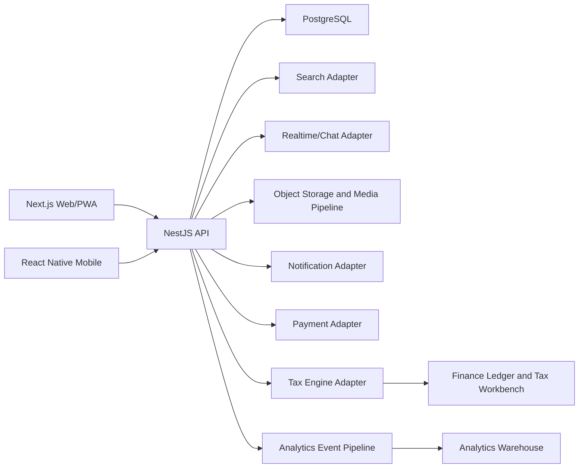
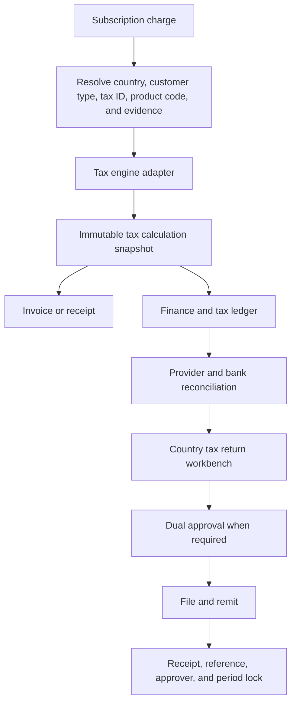
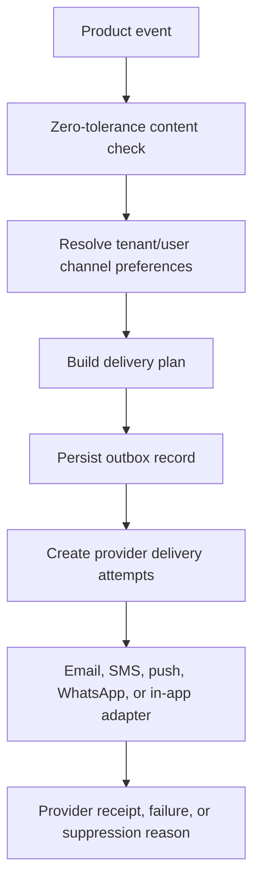

# Telpen Adverts Technical Architecture

Status: Initial implementation architecture
Date: 2026-06-15
Pilot assumption: Kenya first, globally configurable

## Architecture Goals

- Enforce tenant isolation at every data-access boundary.
- Preserve country, continent, regional, and global reporting dimensions.
- Make Source Finder and the commercial relationship graph first-class capabilities.
- Intercept zero-tolerance content before publishing, indexing, matching, or messaging.
- Produce immutable finance and tax evidence for every paid transaction.
- Keep payment, tax, search, messaging, moderation, and notification providers replaceable.
- Share TypeScript domain contracts across web, API, and future React Native applications.

## Repository Structure

```text
apps/
  api/        NestJS HTTP API and application services
  web/        Next.js responsive web and PWA
packages/
  database/   Prisma schema, migrations, generated client, seed data
  domain/     Shared entities, constants, validation, and policy rules
  config/     Shared TypeScript and lint configuration
docs/
  ARCHITECTURE.md
  IMPLEMENTATION_BACKLOG.md
```

## Runtime Components



## Tenant and Administrative Scope

Every tenant-owned record includes `tenantId`. Country-relevant records include
`countryId`; reporting records also carry continent and regional dimensions.

Administrative scope is explicit:

- Global administrators may access all assigned regions.
- Regional administrators may access assigned continents/countries.
- Continental administrators may access countries in their continent.
- Country administrators may access their country only.
- Tenant users may access their tenant only.

The API must never trust a tenant or administrative scope supplied by the client
without validating it against the authenticated user's assignments.

## Initial Domain Modules

- Geography: continents, countries, regions, flags, currencies, locale settings.
- Industry taxonomy: categories, subcategories, synonyms, and supply-chain roles.
- Tenancy: tenants, tenant users, roles, permissions, and scope.
- Auth: tenant-owner registration, password metadata, token-hashed sessions,
  generated time-limited MFA challenges, hashed email verification and password
  reset challenges, tenant invite tokens, tenant auth audit lookup, terms
  acceptance evidence, in-memory and Prisma repository adapters, tenant session
  guard, and future identity-provider adapter boundary.
- Profiles: draft, preview, publish, profile completeness, contacts, live
  version preservation, and publish audit evidence. Profile write/preview/publish
  routes require an MFA-verified tenant session. Profile storage uses an
  in-memory repository by default and can switch to Prisma with
  `PROFILE_REPOSITORY=prisma` after migrations and seed data are ready. Profile
  publish requires request-level terms acceptance plus current stored terms
  evidence when auth is attached; high-risk profile edits enter `PENDING_REVIEW`
  with persisted review reasons and cannot publish until the MVP owner/admin
  review workflow approves them. Rejected drafts remain blocked until edited.
- Listings: draft, preview, publish, media, lifecycle, and visibility. Advert
  listing and lifecycle routes require an MFA-verified tenant session.
- Safety: blocked categories, policy decisions, moderation cases, and reports.
- Discovery: Source Finder, search, filters, reason codes, and saved searches.
  Tenant-scoped discovery routes require an MFA-verified tenant session.
- Relationships: producer, supplier, consumer, distributor, installer, logistics,
  financier, and certifier links.
- Matching: rules first, then semantic and graph ranking.
- Conversations: inquiries, chat, RFQs, quotes, assignment, saved replies,
  response SLAs, message safety checks, and notification alerts. Lead and
  conversation routes require an MFA-verified tenant session.
- Notifications: tenant preferences, consent-aware channel planning, outbox
  records, provider delivery attempts, suppression reasons, and scheduler jobs.
  Tenant notification routes require an MFA-verified tenant session.
- Billing: trial, subscription, invoice, payment, refund, and chargeback.
- Finance: country tax profiles, tax snapshots, ledger, reconciliation, returns,
  remittances, alerts, approvals, and evidence. Tenant finance routes require
  an MFA-verified tenant session.
- Analytics: privacy-aware product and business events. Tenant analytics routes
  require an MFA-verified tenant session.

## Safety Interception Points

Zero-tolerance policy validation runs at:

1. Account and tenant onboarding.
2. Industry, profile, listing, and relationship-link submission.
3. Media upload before public preview or publishing.
4. Search query processing and indexing.
5. Matching and recommendation generation.
6. Chat and inquiry submission.
7. Paid promotion and payment eligibility.

Policy decisions are audit logged with rule identifier, matched signal, source
surface, action, reviewer when applicable, and timestamp.

## Finance and Tax Flow



Paid launch is blocked for a country until its pricing row, tax profile, tax
calendar, payment adapter, invoice template, finance owner, and remittance
workflow are approved.

## Data and API Conventions

- UUID identifiers generated by the application/database.
- UTC timestamps stored in the database and localized only at presentation.
- ISO 3166-1 alpha-2 country codes and ISO 4217 currency codes.
- Soft archive for business records; controlled deletion for privacy requests.
- Idempotency keys for billing, tax, media, and notification operations.
- Cursor pagination for large lists.
- Structured error codes suitable for web and mobile localization.
- OpenAPI documentation generated from the API.
- Audit logs for sensitive administration, finance, safety, and access actions.
- Auth audit metadata must avoid raw secrets, raw tokens, MFA codes, invite
  links, and raw email addresses; hash identifiers where evidence needs
  correlation without exposing the submitted value.
- Access assignments record user, role, scope level, region, continent, country,
  tenant, MFA requirement, expiry, revocation, and assignment source.
- Request body sanitisation runs before DTO validation and safety checks. It
  normalizes Unicode text, strips hidden format/control characters, limits
  nested payload traversal, and preserves secret fields such as passwords and
  session tokens.
- Prisma migrations are checked in and deployed with
  `npm run db:migrate:deploy`; baseline domain data is loaded with
  `npm run db:seed` before enabling hosted Prisma-backed repositories such as
  `AUTH_REPOSITORY=prisma` and `PROFILE_REPOSITORY=prisma`.

## Notification Flow



In-app delivery is the baseline channel. Email, SMS, push, and WhatsApp must be
enabled only where consent, country rules, and provider support allow them.

## Initial Deployment Shape

The MVP begins as a modular monolith. Deployment migration is paused while core
coding continues; DigitalOcean is the leading production candidate to evaluate
next because of the Africa latency requirement, while Railway remains the
current proven fallback/staging deployment.

- One NestJS API web service.
- One Next.js web/PWA service.
- One managed PostgreSQL database with strict tenant-aware repositories.
- One Redis-compatible service for queues, rate limits, realtime fan-out, and
  future chat presence.
- Scheduled jobs for advert lifecycle and conversation SLA sweeps.
- Managed object storage/CDN.
- External provider adapters behind internal interfaces.

Modules can be extracted into services only when scale, ownership, or reliability
requires it. This avoids premature distributed-system complexity.

## Quality Gates

- Type checking and linting for all workspaces.
- Unit tests for policy and domain rules.
- API integration tests for tenant isolation and administrative scope.
- Database migration validation.
- End-to-end tests for onboarding, profile draft/preview/publish, Source Finder,
  chat inquiry, and subscription/tax flows.
- Security tests for broken object-level authorization.
- Accessibility checks for primary web workflows.
