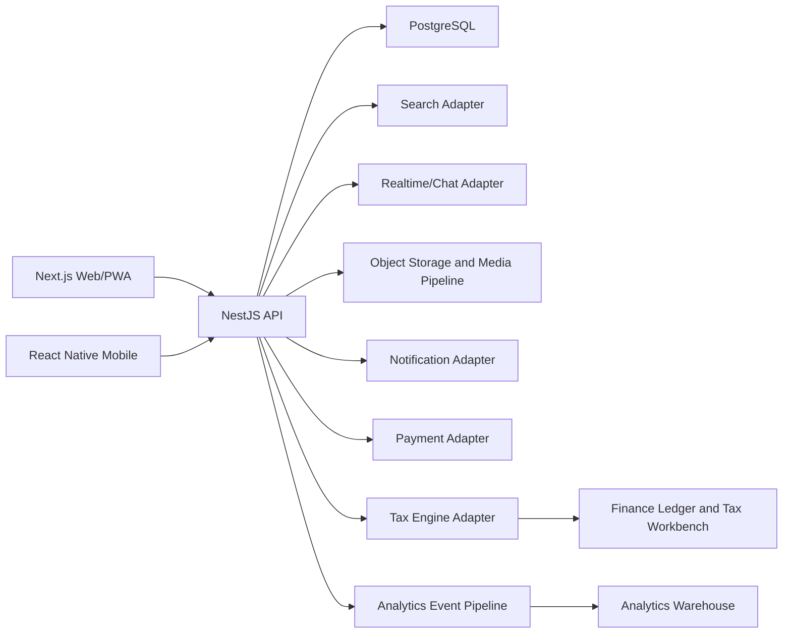
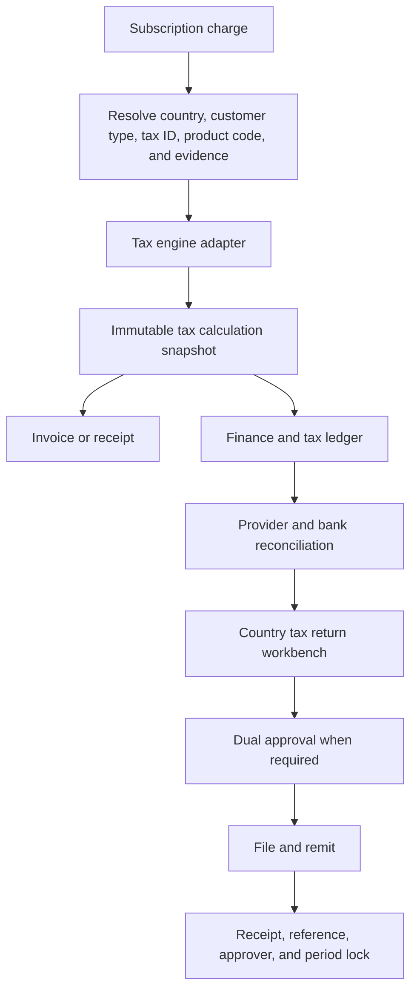
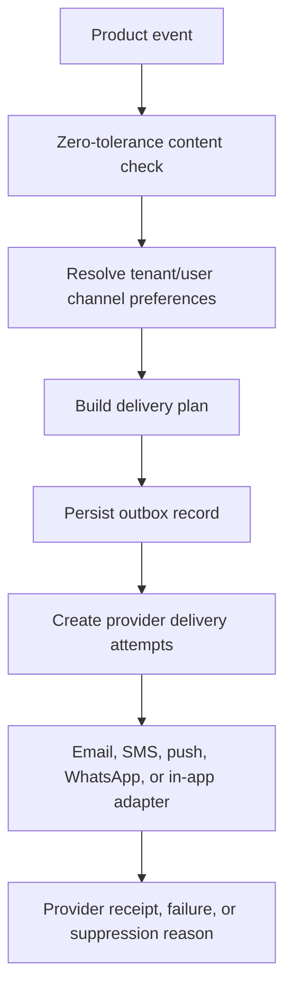

# Telpen Adverts Technical Architecture

Status: Initial implementation architecture
Date: 2026-06-15
Pilot assumption: Kenya first, globally configurable

## Architecture Goals

- Enforce tenant isolation at every data-access boundary.
- Preserve country, continent, regional, and global reporting dimensions.
- Make Source Finder and the commercial relationship graph first-class capabilities.
- Intercept zero-tolerance content before publishing, indexing, matching, or messaging.
- Produce immutable finance and tax evidence for every paid transaction.
- Keep payment, tax, search, messaging, moderation, and notification providers replaceable.
- Share TypeScript domain contracts across web, API, and future React Native applications.

## Repository Structure

```text
apps/
  api/        NestJS HTTP API and application services
  web/        Next.js responsive web and PWA
packages/
  database/   Prisma schema, migrations, generated client, seed data
  domain/     Shared entities, constants, validation, and policy rules
  config/     Shared TypeScript and lint configuration
docs/
  ARCHITECTURE.md
  IMPLEMENTATION_BACKLOG.md
```

## Runtime Components



## Tenant and Administrative Scope

Every tenant-owned record includes `tenantId`. Country-relevant records include
`countryId`; reporting records also carry continent and regional dimensions.

Administrative scope is explicit:

- Global administrators may access all assigned regions.
- Regional administrators may access assigned continents/countries.
- Continental administrators may access countries in their continent.
- Country administrators may access their country only.
- Tenant users may access their tenant only.

The API must never trust a tenant or administrative scope supplied by the client
without validating it against the authenticated user's assignments.

## Initial Domain Modules

- Geography: continents, countries, regions, flags, currencies, locale settings.
- Industry taxonomy: categories, subcategories, synonyms, and supply-chain roles.
- Tenancy: tenants, tenant users, roles, permissions, and scope.
- Auth: tenant-owner registration, password metadata, token-hashed sessions,
  generated time-limited MFA challenges, hashed email verification and password
  reset challenges, tenant invite tokens, tenant auth audit lookup, terms
  acceptance evidence, in-memory and Prisma repository adapters, tenant session
  guard, Resend overlay for verification/reset/invite/email-MFA delivery,
  authenticator TOTP enrollment (RFC 6238 SHA-1, 6 digits, 30s, ±1 window),
  hashed single-use recovery codes, and an OIDC hosted-identity overlay
  (Auth0/Clerk/generic) that exchanges a verified ID token for an existing
  tenant session.
- Profiles: draft, preview, publish, profile completeness, enriched contacts,
  service-area coverage, profile media display metadata, live version
  preservation, and publish audit evidence. Profile write/preview/publish/media
  routes require an MFA-verified tenant session.
  Profile storage uses an in-memory repository by default and can switch to
  Prisma with `PROFILE_REPOSITORY=prisma` after migrations and seed data are
  ready. Profile publish requires request-level terms acceptance plus current
  stored terms evidence when auth is attached; high-risk profile edits enter
  `PENDING_REVIEW` with persisted review reasons and cannot publish until the
  MVP owner/admin review workflow or a scoped platform moderator approves them.
  Platform profile moderation uses MFA-required `MODERATE_CONTENT` access
  assignments, target country/tenant checks, and access-decision audit records.
  Rejected drafts remain blocked until edited. Profile media uses tenant-owned
  `MediaAsset` records attached to draft/live owners, a ten-item display cap,
  recursive metadata safety checks, publish-time media carry-over, provider
  upload preparation, and storage/moderation/CDN transform adapter hooks.
  S3-compatible presigned PUT uploads are supported through env-configured
  Signature V4 signing. Media scan/transform jobs can use a Prisma/PostgreSQL
  outbox selected with `MEDIA_JOB_QUEUE_DRIVER=prisma`, including worker claim,
  retry, completion, and failure state. An internal job-key protected media
  processing runner can execute bounded batches via
  `POST /v1/operations/media/processing/run`. Generic HTTP processor adapters
  can call malware/media scanning, image transform, and video transcoding
  providers. Prisma media-result publication updates `MediaAsset` moderation
  state, blocked fail-closed state, transform status, CDN URLs, thumbnails, and
  variants. Unsafe or final-failed processing creates durable
  `MediaReviewCase` records with severity, reason, source job, provider, and
  evidence. DigitalOcean Spaces credentials overlay live object storage through
  `SPACES_*` aliases. ClamAV and Sightengine overlay malware and visual
  moderation when configured. Transform jobs verify public CDN URLs with an
  HTTPS Range GET before succeeding. Kenya legal/reporting playbooks attach
  KE-CIRT, NCMEC CyberTipline, and hosting-abuse channels on escalate and
  severe confirmed-block decisions. Other countries fail closed until a
  playbook is approved. Tenant media responses now include a user-facing
  review status and omit internal reasons. Public discovery only includes
  files that are ready to display.
- Listings: draft, preview, publish, scheduled go-live, media, lifecycle, and visibility. Advert
  listing, lifecycle, and media routes require an MFA-verified tenant session.
  Advert media uses shared `MediaAsset` metadata, the ten-item display cap,
  recursive safety checks, upload preparation, and the same
  storage/moderation/CDN transform adapter hooks as profile media. A future
  `publishedAt` keeps the listing `SCHEDULED` and out of public discovery until
  the lifecycle sweep promotes it to `LIVE`.
  See `docs/MEDIA_PIPELINE.md` for storage mode and worker queue configuration.
- Safety: blocked categories, policy decisions, moderation cases, and reports.
- Discovery: Source Finder, search, filters, reason codes, saved searches,
  cadence-backed opportunity alerts, and consent-gated outcome feedback.
  Tenant Source Finder routes require an MFA-verified tenant session. Opt-in
  Prisma persistence is selected with `SOURCE_FINDER_REPOSITORY=prisma`.
  Catalog search documents persist through the same flag, with
  `POST /v1/source-finder/index/reindex` rebuilding the index.
  Indexed documents use token overlap in memory and Postgres `tsvector`
  ranking when `SOURCE_FINDER_REPOSITORY=prisma`. Search responses include
  `searchMode` (`RULES` | `FTS` | `HYBRID` | `SEMANTIC`) and `KEYWORD_MATCH`.
  Optional OpenAI `text-embedding-3-small` overlays when `OPENAI_API_KEY` is
  set; `SOURCE_FINDER_EMBEDDING_PROVIDER=openai` fail-closes without the key.
  Semantic hits add `SEMANTIC_MATCH`. Index summaries omit vectors.
  `GET /v1/source-finder/hierarchy` rolls catalog records into country,
  industry, role, and relationship-link dashboards.
  Hide/report always suppress a tenant's results; accept/save ranking boosts
  require behavioral matching consent.
- Relationships: structured claims (`SUPPLIES_TO`, `BUYS_FROM`, `PRODUCES`,
  `DISTRIBUTES`, `CONSUMES`, `INSTALLS`, `REPAIRS`, `FINANCES`, `CERTIFIES`,
  `SHIPS`, `WHOLESALES`, `RETAILS`, `PARTNERS_WITH`) with public, private,
  request-only, and verified visibility. Public/verified claims stay off the
  graph until the counterpart or a moderator approves them. Tenant relationship
  routes require an MFA-verified tenant session.
- Matching: rules first, then semantic and graph ranking.
- Conversations: inquiries, chat, RFQs, quotes, assignment, saved replies,
  response SLAs, message safety checks, delivery/read receipts, typing
  indicators, unread counts, tenant-only attachments with malware/moderation
  gates, session-authenticated Socket.IO delivery, online presence, and
  notification alerts. Lead and conversation
  routes require an MFA-verified tenant session. Opt-in Prisma persistence is
  selected with `CONVERSATIONS_REPOSITORY=prisma`. The live chat namespace is
  `/v1/conversations`; presence is in-process until Redis fan-out is required.
- Notifications: tenant preferences, consent-aware channel planning, outbox
  records, adapter dispatch (memory by default; Resend email, Africa's Talking
  SMS, FCM push, and WhatsApp Cloud or Africa's Talking WhatsApp when
  credentials are set), delivery attempts, suppression
  reasons, and scheduler jobs. Tenant notification routes require an
  MFA-verified tenant session. Opt-in Prisma persistence is selected with
  `NOTIFICATIONS_REPOSITORY=prisma` and stores preferences, destination,
  channel statuses, and delivery attempts. `POST /v1/operations/notifications/dispatch/run`
  retries queued or failed outbox channels.
- Audit: tenant-scoped product audit logs for conversation and notification
  writes, with secret/contact/message-body redaction. Owner/admin lookup is
  `GET /v1/audit`. Auth, profile, advert, and safety events continue to use the
  same `AuditLog` trail.
- Billing: trial, subscription, invoice, payment, refund, and chargeback.
- Finance: country tax profiles, tax snapshots, ledger, reconciliation, returns,
  remittances, alerts, approvals, and evidence. Tenant finance routes require
  an MFA-verified tenant session. Opt-in Prisma persistence is selected with
  `FINANCE_REPOSITORY=prisma`.
- Analytics: privacy-aware product and business events. Tenant analytics routes
  require an MFA-verified tenant session.

## Safety Interception Points

Zero-tolerance policy validation runs at:

1. Account and tenant onboarding.
2. Industry, profile, listing, and relationship-link submission.
3. Media upload before public preview or publishing.
4. Search query processing and indexing.
5. Matching and recommendation generation.
6. Chat and inquiry submission.
7. Paid promotion and payment eligibility.

Policy decisions are audit logged with rule identifier, matched signal, source
surface, action, reviewer when applicable, and timestamp.

## Finance and Tax Flow



Paid launch is blocked for a country until its pricing row, tax profile, tax
calendar, payment adapter, invoice template, finance owner, and remittance
workflow are approved.

The current finance command API can generate tenant-scoped invoices, receipts,
refund credit notes, chargeback records, dunning notices, and related tax or
reversal ledger entries with country/year document numbers. Country tax returns
move through review, reconciliation-gated approval, dual filing approval,
evidence attachment, remittance, period lock, and controlled post-lock
corrections, with CSV/JSON exports and product-audit events. Opt-in Prisma
persistence is selected with `FINANCE_REPOSITORY=prisma`. Invoice capture uses
`PAYMENT_PROVIDER=manual` by default; `stripe`, `africastalking`, and `live`
select Stripe PaymentIntents and/or Africa's Talking M-Pesa checkout. Pending
provider captures stay `REQUIRES_CAPTURE` until `POST /v1/finance/payments/settle`.

## Data and API Conventions

- UUID identifiers generated by the application/database.
- UTC timestamps stored in the database and localized only at presentation.
- ISO 3166-1 alpha-2 country codes and ISO 4217 currency codes.
- Soft archive for business records; controlled deletion for privacy requests.
- Idempotency keys for billing, tax, media, and notification operations.
- Cursor pagination for large lists.
- Structured error codes suitable for web and mobile localization.
- OpenAPI documentation generated from the API.
- Audit logs for sensitive administration, finance, safety, access, conversation,
  and notification actions.
- Auth audit metadata must avoid raw secrets, raw tokens, MFA codes, invite
  links, and raw email addresses; hash identifiers where evidence needs
  correlation without exposing the submitted value.
- Access assignments record user, role, scope level, region, continent, country,
  tenant, MFA requirement, expiry, revocation, and assignment source.
- Request body sanitisation runs before DTO validation and safety checks. It
  normalizes Unicode text, strips hidden format/control characters, limits
  nested payload traversal, and preserves secret fields such as passwords and
  session tokens.
- Prisma migrations are checked in and deployed with
  `npm run db:migrate:deploy`; baseline domain data is loaded with
  `npm run db:seed` before enabling hosted Prisma with
  `PERSISTENCE_DRIVER=prisma` and `DATABASE_URL`. Per-repository keys such as
  `AUTH_REPOSITORY=memory` still override the overlay. Unset driver keeps the
  in-memory default even if `DATABASE_URL` exists. `GET /v1/health` reports
  `persistence.driver`, `mode`, and `databaseConfigured` without the URL.
- Media processing queue persistence is enabled with
  `PERSISTENCE_DRIVER=prisma` or `MEDIA_JOB_QUEUE_DRIVER=prisma` after applying
  the database migrations and setting `DATABASE_URL`; development and tests use
  the in-memory queue by default. The protected operations runner can be scheduled
  by cron or run from a dedicated worker service once provider adapters are
  configured. Media asset result publication uses
  `MEDIA_ASSET_RESULT_PUBLISHER_DRIVER=prisma`, follows `PERSISTENCE_DRIVER=prisma`,
  or is selected when the Prisma media queue is enabled. Unsafe media review cases
  are persisted in `MediaReviewCase`
  and indexed by tenant, status, severity, job type, media, and source job.
  List and GET responses add computed SLA fields (CRITICAL 24h, HIGH 72h,
  MEDIUM 168h from `openedAt`). HIGH/CRITICAL restore or dismiss requires
  mistaken-classification confirmation plus a reviewer note. Dismissed cases
  can be reopened; escalated and resolved cases stay closed.
- Analytics event persistence is enabled with `ANALYTICS_REPOSITORY=prisma`
  after migrations are applied and `DATABASE_URL` is set. The service writes
  consent-aware events to `AnalyticsEvent` and summarizes tenant-scoped views,
  clicks, inquiries, shares, downloads, saved searches, searches, and matches
  from that durable store; development and tests keep the in-memory repository.
- Tenant analytics reports are exported as aggregated CSV/JSON/PDF payloads from
  the analytics service; raw event metadata is excluded by default to reduce
  privacy risk. Raw event retention is pruned through the protected
  `POST /v1/operations/analytics/retention/run` job, which supports dry-runs
  and resolves country/legal retention policy metadata before deleting raw
  events. The job defaults to a 395-day platform window, supports country-scoped
  pruning, and records whether an operator-supplied retention-day override was
  applied.
- Analytics warehouse groundwork is stored in `AnalyticsDailyRollup`, which
  aggregates daily tenant/country/industry/entity/consent rows with event-type
  counters and no raw event metadata. The protected
  `POST /v1/operations/analytics/rollups/run` job rebuilds a requested period
  and scope from raw events, supports dry-runs, and replaces existing aggregate
  rows for that slice. Tenant and hierarchy reports accept `dataSource=AUTO`,
  `dataSource=RAW`, or `dataSource=ROLLUP`; `AUTO` uses daily rollups when rows
  are available and falls back to raw events otherwise, while exports include
  warehouse metadata identifying the resolved source.
- Analytics privacy request automation runs through the protected
  `POST /v1/operations/analytics/privacy-requests/run` job. It supports
  tenant-scoped access summaries and erasure requests, optional country/date
  scoping, dry-run-by-default erasure, rollup cleanup/rebuild after deletion,
  and returns aggregate summaries without raw event metadata.
- Analytics retention policies include legal approval status, review due dates,
  and country-specific legal basis metadata. Emergency `retentionDays`
  overrides are rejected unless the internal job supplies an
  `approvalReference`, and retention results report whether the resolved policy
  still requires legal approval.
- Platform hierarchy analytics uses `VIEW_ANALYTICS` platform access
  assignments before returning global, regional, continental, country, or tenant
  reports. Reports are scope-filtered from the analytics repository and include
  top countries, tenants, entities, industries, and consent-state breakdowns.
- Platform hierarchy analytics exports reuse the same scoped access checks and
  return aggregated CSV/JSON/PDF payloads from
  `GET /v1/platform/analytics/hierarchy/export`; raw event metadata remains
  excluded from export payloads.
- The web/PWA Analytics Command panel mirrors the hierarchy reporting model with
  selectable scope, CSV/JSON/PDF export readiness, raw/rollup data-source
  selection, grant/block state from `VIEW_ANALYTICS`, aggregate counters, top
  country, industry, and tenant previews, and the protected report/export API
  routes. It can load live hierarchy report data with an `x-session-token`,
  supports first-party platform sign-in/session/MFA verification, and falls back
  to seeded preview metrics when no verified session is available or the session
  changes.

## Notification Flow



In-app delivery is the baseline channel. Email, SMS, push, and WhatsApp must be
enabled only where consent, country rules, and provider support allow them.

## Initial Deployment Shape

The MVP begins as a modular monolith. Deployment migration is paused while core
coding continues; DigitalOcean is the leading production candidate to evaluate
next because of the Africa latency requirement, while Railway remains the
current proven fallback/staging deployment.

- One NestJS API web service.
- One Next.js web/PWA service.
- One managed PostgreSQL database with strict tenant-aware repositories.
- One Redis-compatible service for queues, rate limits, realtime fan-out, and
  multi-instance chat presence.
- Scheduled jobs for advert lifecycle and conversation SLA sweeps.
- Managed object storage/CDN.
- External provider adapters behind internal interfaces.

Modules can be extracted into services only when scale, ownership, or reliability
requires it. This avoids premature distributed-system complexity.

## Quality Gates

- Type checking and linting for all workspaces.
- Unit tests for policy and domain rules.
- API integration tests for tenant isolation and administrative scope.
- Database migration validation.
- End-to-end tests for onboarding, profile draft/preview/publish, Source Finder,
  chat inquiry, and subscription/tax flows.
- Security tests for broken object-level authorization.
- Accessibility checks for primary web workflows.
