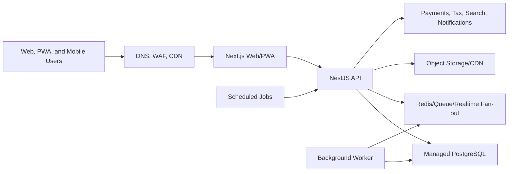

# Sell Find Connect DigitalOcean Deployment Runbook

Status: Active — DigitalOcean selected; production domain `sellfindconnect.com`
Date: 2026-06-18
Last updated: 2026-06-24

## Current Decision

DigitalOcean App Platform is the chosen production host. The canonical domain is
**`sellfindconnect.com`**, owned by the project owner through **GoDaddy**. This
runbook is the executable path to first launch; the App Platform spec lives at
`deploy/digitalocean/app.yaml` and builds from the existing
`deploy/web.Dockerfile` and `deploy/api.Dockerfile`.

DigitalOcean was chosen because the first country launch needs strong Africa
latency. Pick the closest available App Platform region (e.g. `fra1`) until a
South Africa point of presence is available; keep latency-critical web/API close
to users and durable services in the nearest stable region.

## Verification Gate

Before committing production infrastructure to DigitalOcean, verify the exact
availability of these products in the Cape Town/South Africa location:

- App Platform or deployable container hosting for the Next.js web app and
  NestJS API.
- Managed PostgreSQL.
- Managed Redis or Redis-compatible cache/queue service.
- Load balancer, TLS certificates, custom domains, and health checks.
- Container registry or GitHub-connected deploy flow.
- Kubernetes/Droplets fallback if App Platform is not available in the target
  region.
- Backups, point-in-time restore, monitoring, logs, alerts, and rollback tools.
- Object storage/CDN path for future media.

If any required managed service is not available in Cape Town, prefer a
DigitalOcean architecture that keeps latency-critical web/API services closest
to users while placing durable services in the nearest stable supported region,
or reconsider another provider with complete Cape Town coverage.

## Target Architecture After Coding Completion



## Required Services

- Web app service for `sellfindconnect.com` and `www.sellfindconnect.com`.
- API service path-routed at `sellfindconnect.com/api` (or `api.sellfindconnect.com`
  if you choose the two-app subdomain layout).
- Managed PostgreSQL for tenant, auth, finance, analytics, moderation, and
  relationship graph data.
- Redis-compatible service for queues, rate limits, chat fan-out, notification
  state, and future presence.
- Worker process for notifications, media moderation, analytics rollups, tax
  reminders, matching jobs, and search indexing.
- Scheduler for advert lifecycle, day-35/day-39 renewal alerts, day-40
  auto-deletion, conversation SLA sweeps, analytics retention pruning, and
  finance/tax alert checks.
- Object storage/CDN for images and clips.
- Monitoring, logs, uptime alerts, error tracking, and backup verification.

## Cutover Policy

No paying subscriber should be onboarded until:

- The production provider decision is final.
- DNS, TLS, health checks, backups, rollbacks, logs, and alerts are verified.
- Web and API smoke tests pass.
- Owner onboarding, login, MFA, tenant-session checks, terms gate, safety
  blocking, Source Finder, lead conversion, notifications, analytics, advert
  lifecycle, and finance/tax readiness pass.
- Scheduled jobs run successfully.
- Database migrations and seed data are repeatable.
- Railway remains available as fallback until the new platform is stable.

## Database Readiness Commands

Run these from the repository root after the target PostgreSQL `DATABASE_URL`
is configured in the environment and before enabling `AUTH_REPOSITORY=prisma`,
`PROFILE_REPOSITORY=prisma`, and `ANALYTICS_REPOSITORY=prisma` in production:

- `npm run db:validate`
- `npm run db:generate`
- `npm run db:migrate:status`
- `npm run db:migrate:deploy`
- `npm run db:seed`

The seed command builds the shared domain package first, then loads baseline
continents, country configuration, and industry categories from the same data
used by the web and API.

## Step-by-step: first deployment (App Platform)

Prerequisites: a DigitalOcean account, `doctl` installed and authenticated
(`doctl auth init`), and GitHub connected to DigitalOcean for
`Bucrepinfo-lab/sellfindconnect.com`.

1. **Pick the region.** Edit `region:` in `deploy/digitalocean/app.yaml` to the
   closest available App Platform region (e.g. `fra1`).
2. **Create the app from the spec:**
   ```
   doctl apps create --spec deploy/digitalocean/app.yaml
   ```
   This provisions the `web` and `api` services, the managed `sfc-postgres`
   database, and the `db-migrate` pre-deploy job.
3. **Set secrets** in the DO dashboard (App → Settings → each component → Env):
   - `api` → `INTERNAL_JOB_KEY` = a long random secret (used by scheduled jobs).
   - Any live `PAYMENT_PROVIDER` / media-storage secrets only after approval.
   `DATABASE_URL` is auto-injected from the managed DB (`${sfc-postgres.DATABASE_URL}`).
4. **First deploy runs migrations** automatically via the `db-migrate`
   PRE_DEPLOY job (`npm run db:migrate:deploy`). Seed once, manually, from a
   console or a one-off job: `npm run db:seed`.
5. **Add the custom domains** (App → Settings → Domains): `sellfindconnect.com`
   (primary) and `www.sellfindconnect.com`. The API is path-routed on the same
   domain (`/api`), so no API subdomain is needed in this layout. DO displays the
   exact DNS target for each domain and auto-provisions Let's Encrypt TLS once
   DNS resolves.

## GoDaddy DNS records

The spec uses a single app with path-based routing, so only the apex and `www`
point at DigitalOcean. Two clean options:

**Option A (recommended) — delegate DNS to DigitalOcean.** In GoDaddy, set the
domain's nameservers to `ns1.digitalocean.com`, `ns2.digitalocean.com`,
`ns3.digitalocean.com`. Then DO manages the apex `ALIAS` automatically (this is
what `app.yaml`'s `type: ALIAS`/`PRIMARY` assumes). Nothing else to add in
GoDaddy.

**Option B — keep DNS at GoDaddy.** Point records at the targets DO shows
(App → Settings → Domains gives a `*.ondigitalocean.app` hostname):

| Type  | Name | Value                              | Notes                       |
| ----- | ---- | ---------------------------------- | --------------------------- |
| A     | @    | (DO-provided apex IP)              | Apex `sellfindconnect.com`  |
| CNAME | www  | `<app>.ondigitalocean.app`         | `www.sellfindconnect.com`   |

Notes:
- GoDaddy does not support a true apex `CNAME`; for the apex use the **A record**
  DO provides (Option B) or delegate nameservers (Option A).
- Remove GoDaddy parking/forwarding records for `@` and `www` first.
- After records propagate, DO issues TLS automatically and forces HTTPS. Verify
  `https://sellfindconnect.com`, `https://www...` (redirects to apex), and the
  API at `https://sellfindconnect.com/api/v1/health`.

> Subdomain alternative: if you prefer `api.sellfindconnect.com`, deploy the API
> as a **second** App Platform app, add that subdomain to it (CNAME `api` →
> its `*.ondigitalocean.app`), and set the web app's
> `NEXT_PUBLIC_API_URL=https://api.sellfindconnect.com/v1`.

## Scheduled jobs

DigitalOcean App Platform has no native recurring cron (only PRE/POST-deploy
jobs), so production scheduling runs from the checked-in GitHub Actions workflow
**`.github/workflows/scheduled-jobs.yml`**, which POSTs to the protected internal
endpoints with header `x-internal-job-key: $INTERNAL_JOB_KEY`:

- `POST /v1/operations/conversations/sla/run` — every 15 min.
- `POST /v1/operations/media/processing/run` — every 15 min (scan/transform tick).
- `POST /v1/operations/adverts/lifecycle/run` — daily (day-35/39 alerts, day-40 delete).
- `POST /v1/operations/analytics/rollups/run` — daily warehouse rebuild.
- `POST /v1/operations/analytics/retention/run` — weekly retention sweep.

Set two **GitHub repository secrets** (Settings → Secrets and variables →
Actions): `API_BASE_URL` (e.g. `https://sellfindconnect.com/api/v1`) and
`INTERNAL_JOB_KEY` (the same value set on the API service). You can trigger any
group manually via the workflow's "Run workflow" button.

> Not yet automated: finance remittance alerts run per-tenant
> (`POST /v1/finance/alerts/run`, tenant-session protected). Add an all-tenant
> internal endpoint (like the others) before scheduling it here.

Alternatively, run the same calls from a DigitalOcean Function with a scheduled
trigger or a small worker service if you prefer to keep scheduling on DO.

## Cutover smoke checklist

Before onboarding any paying subscriber, verify on the live domains:
- `GET https://sellfindconnect.com/api/v1/health` returns healthy.
- Web loads at `https://sellfindconnect.com`; `www` redirects to apex.
- Owner registration, login, MFA, tenant-session checks.
- Terms gate + zero-tolerance blocking on publish/upload/chat/pay.
- Source Finder, lead conversion, notifications, analytics dashboards.
- Advert lifecycle + finance/tax readiness; invoice → payment → receipt →
  reconciliation round-trips with `PAYMENT_PROVIDER=manual`.
- Scheduled jobs run and migrations/seed are repeatable.

## Current Deployment Posture

- DigitalOcean App Platform is the selected production host; spec checked in at
  `deploy/digitalocean/app.yaml`.
- `sellfindconnect.com` (GoDaddy) is the canonical domain; `api.` subdomain for
  the API, `www.` redirects to apex.
- Railway remains available as a fallback/staging target until DigitalOcean is
  verified stable. Render is not used.
- Go live only after the cutover smoke checklist passes.
