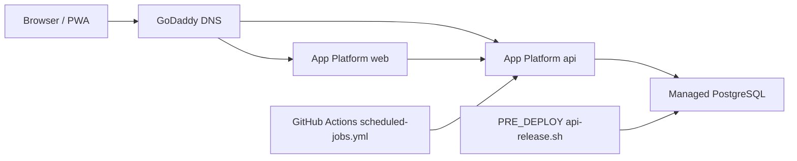

# DigitalOcean App Platform — candidate only

Status: **Not live.** Do not point `sellfindconnect.com` DNS here.
Date: 2026-08-22
Live host: Fly.io Frankfurt — `docs/FLY_DEPLOYMENT.md`

This file is the checked-in **candidate plan** if the owner later wants managed
Postgres and App Platform (for example a closer African region). It is not a
recovery path and it is not what production serves today.

| Surface | Live today | This candidate spec |
| --- | --- | --- |
| Web | `https://sellfindconnect.com` on Fly (`sellfindconnect-web`) | Same hostname, App Platform `web` service |
| API | `https://api.sellfindconnect.com/v1` on Fly (`sellfindconnect-api`) | Path-routed `https://sellfindconnect.com/api/v1` **or** a second app on `api.sellfindconnect.com` |
| Postgres | Hosted `DATABASE_URL` on Fly (Prisma live) | App Platform managed `sfc-postgres` |
| Jobs | GitHub Actions cron + `INTERNAL_JOB_KEY` | Same workflow; change `API_BASE_URL` if the API host changes |

Railway is **not** a fallback. Those URLs 404. See `docs/GIT_RAILWAY_RUNBOOK.md`.

## When to use this spec

Use `deploy/digitalocean/app.yaml` only after a written decision to leave Fly.
Until then:

- Keep GoDaddy DNS on Fly.
- Do not run `doctl apps create` against the live domain.
- Do not onboard paying subscribers on a second host.

If DigitalOcean is selected, pick the closest App Platform region (`fra1` until
a South Africa PoP exists). Keep web/API close to users; put Postgres in the
nearest stable region if Cape Town cannot host every managed service.

## Architecture (candidate)

The checked-in spec is **one App Platform app**, path-routed:

- web → `https://sellfindconnect.com/`
- api → `https://sellfindconnect.com/api` (prefix stripped; Nest sees `/v1/...`)
- public API base → `https://sellfindconnect.com/api/v1`

That is **not** the live Fly layout (`api.sellfindconnect.com`). If you want
the same hostnames as Fly, deploy API as a **second** app and set
`NEXT_PUBLIC_API_URL=https://api.sellfindconnect.com/v1` (rebuild web).

## Spec file

`deploy/digitalocean/app.yaml` builds the same Dockerfiles Fly uses
(`deploy/web.Dockerfile`, `deploy/api.Dockerfile`) and the same release script
(`sh /app/deploy/api-release.sh`: migrate, then idempotent seed).

It sets `PERSISTENCE_DRIVER=prisma` and injects `DATABASE_URL` from
`sfc-postgres`. Per-repository `memory` overrides still win. Named
`PERSISTENCE_DRIVER=live` fail-closes without `DATABASE_URL`.

`INTERNAL_JOB_KEY` must be set as a **dashboard secret**, never committed.
The placeholder in `app.yaml` is invalid on purpose.

## First create (only after the host decision)

Prerequisites: DigitalOcean account, `doctl auth init`, GitHub connected for
`Bucrepinfo-lab/sellfindconnect.com`.

1. Set `region:` in `deploy/digitalocean/app.yaml` (example: `fra1`).
2. `doctl apps create --spec deploy/digitalocean/app.yaml`
3. In App → Settings, set API secret `INTERNAL_JOB_KEY` to a long random value.
   Set the **same** value in GitHub Actions if jobs should hit this API.
4. First deploy runs `deploy/api-release.sh` as the `db-migrate` PRE_DEPLOY job.
   Set `SKIP_DB_SEED=true` on that job only to skip continents/countries/industries.
5. Add domains only **after** Fly DNS is intentionally removed. DO shows the
   exact target and issues Let's Encrypt once DNS resolves.

### DNS (candidate — do not apply while Fly is live)

**Option A — DigitalOcean nameservers:** `ns1.digitalocean.com`,
`ns2.digitalocean.com`, `ns3.digitalocean.com`. DO manages the apex ALIAS.

**Option B — keep GoDaddy:** A record `@` to the DO apex IP; CNAME `www` to
`<app>.ondigitalocean.app`. GoDaddy cannot CNAME the apex.

Path-routed health check after a real cutover:
`https://sellfindconnect.com/api/v1/health` → `persistence.mode: prisma`.

Subdomain alternative: second app for `api.sellfindconnect.com` (CNAME `api` →
that app's `*.ondigitalocean.app`).

## Jobs

App Platform has no app-level cron. Keep
`.github/workflows/scheduled-jobs.yml`.

If the API stays on Fly, leave GitHub `API_BASE_URL` =
`https://api.sellfindconnect.com/v1`.

If the API moves to DigitalOcean path routing, set
`API_BASE_URL=https://sellfindconnect.com/api/v1` and keep
`INTERNAL_JOB_KEY` matched to the API secret.

Endpoints (header `x-internal-job-key`):

- every 15 min: conversations SLA, notification dispatch, media processing,
  Source Finder alerts
- daily 02:00 UTC: advert lifecycle, account-deletion grace sweep, analytics
  rollups, finance remittance alerts
- weekly Sunday 03:00 UTC: analytics retention

## Manual database commands

From the repo root against the **target** `DATABASE_URL` only:

- `npm run db:validate`
- `npm run db:generate`
- `npm run db:migrate:status`
- `npm run db:migrate:deploy`
- `npm run db:seed`

Do not point these at the live Fly database from a DigitalOcean experiment.

## Paying subscribers

Infra on Fly is already cut over (Prisma + jobs + privacy URLs). A DigitalOcean
move does **not** unlock paid onboarding. Still required:

- approved country tax profile
- live `PAYMENT_PROVIDER` / STK review (login phone only)
- finance gates in `docs/FLY_DEPLOYMENT.md`
