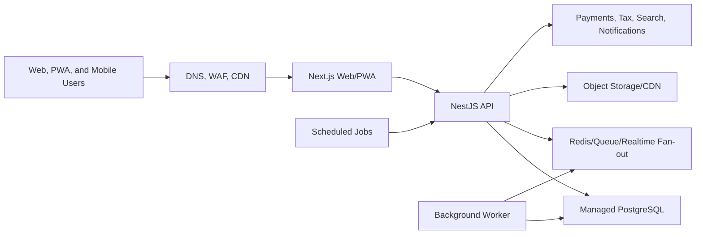

# Sell Find Connect DigitalOcean Deployment Candidate

Status: Deployment paused while product coding continues
Date: 2026-06-18

## Current Decision

Do not start a new deployment migration now. Finish the core product coding
first, then choose and activate the production platform before onboarding
subscribers.

DigitalOcean is now the leading deployment candidate because the first country
launch needs excellent Africa latency, and a Cape Town/South Africa point of
presence or region would be a major advantage if the required DigitalOcean
products are available there.

## Verification Gate

Before committing production infrastructure to DigitalOcean, verify the exact
availability of these products in the Cape Town/South Africa location:

- App Platform or deployable container hosting for the Next.js web app and
  NestJS API.
- Managed PostgreSQL.
- Managed Redis or Redis-compatible cache/queue service.
- Load balancer, TLS certificates, custom domains, and health checks.
- Container registry or GitHub-connected deploy flow.
- Kubernetes/Droplets fallback if App Platform is not available in the target
  region.
- Backups, point-in-time restore, monitoring, logs, alerts, and rollback tools.
- Object storage/CDN path for future media.

If any required managed service is not available in Cape Town, prefer a
DigitalOcean architecture that keeps latency-critical web/API services closest
to users while placing durable services in the nearest stable supported region,
or reconsider another provider with complete Cape Town coverage.

## Target Architecture After Coding Completion

## Required Services

- Web app service for `sellfindconnect.com` and `www.sellfindconnect.com`.
- API service for `api.sellfindconnect.com`.
- Managed PostgreSQL for tenant, auth, finance, analytics, moderation, and
  relationship graph data.
- Redis-compatible service for queues, rate limits, chat fan-out, notification
  state, and future presence.
- Worker process for notifications, media moderation, analytics rollups, tax
  reminders, matching jobs, and search indexing.
- Scheduler for advert lifecycle, day-35/day-39 renewal alerts, day-40
  auto-deletion, conversation SLA sweeps, analytics retention pruning, and
  finance/tax alert checks.
- Object storage/CDN for images and clips.
- Monitoring, logs, uptime alerts, error tracking, and backup verification.

## Cutover Policy

No paying subscriber should be onboarded until:

- The production provider decision is final.
- DNS, TLS, health checks, backups, rollbacks, logs, and alerts are verified.
- Web and API smoke tests pass.
- Owner onboarding, login, MFA, tenant-session checks, terms gate, safety
  blocking, Source Finder, lead conversion, notifications, analytics, advert
  lifecycle, and finance/tax readiness pass.
- Scheduled jobs run successfully.
- Database migrations and seed data are repeatable.
- Railway remains available as fallback until the new platform is stable.

## Database Readiness Commands

Run these from the repository root after the target PostgreSQL `DATABASE_URL`
is configured in the environment and before enabling `AUTH_REPOSITORY=prisma`,
`PROFILE_REPOSITORY=prisma`, and `ANALYTICS_REPOSITORY=prisma` in production:

- `npm run db:validate`
- `npm run db:generate`
- `npm run db:migrate:status`
- `npm run db:migrate:deploy`
- `npm run db:seed`

The seed command builds the shared domain package first, then loads baseline
continents, country configuration, and industry categories from the same data
used by the web and API.

## Current Deployment Posture

- Railway remains the only already-proven live deployment.
- No new deployment migration should be started until coding reaches the next
  production-readiness checkpoint.
- Render is not the active deployment path.
- DigitalOcean is the leading candidate to evaluate because of the Africa
  latency requirement.
