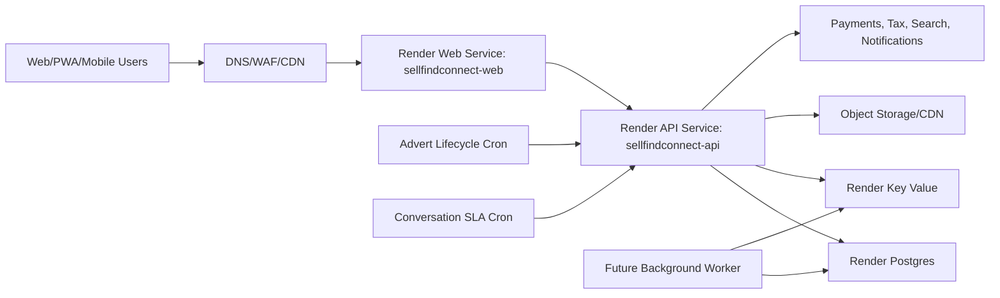

# Sell Find Connect Render Deployment Plan

Status: Primary production target selected
Date: 2026-06-18

## Decision

Render is the selected primary production platform for Sell Find Connect before
subscriber onboarding. Railway remains a temporary fallback/staging deployment
until Render has passed production verification and DNS has moved safely.

This decision is based on the product's expected operating shape:

- Always-on multi-tenant web and API services.
- Managed PostgreSQL as the durable system of record.
- Key Value/Redis-style infrastructure for queues, realtime fan-out, rate
  limits, notification state, and later chat presence.
- Background and scheduled work for advert expiry, day-35/day-39 renewal
  alerts, day-40 deletion, conversation SLA sweeps, tax reminders, analytics
  rollups, and moderation operations.
- Clear reliability posture before paid subscribers are onboarded.

## Render Blueprint

The repository now includes `render.yaml` with:

- `sellfindconnect-web`: Next.js/PWA web service.
- `sellfindconnect-api`: NestJS API service.
- `sellfindconnect-postgres`: managed Postgres database.
- `sellfindconnect-keyvalue`: Key Value service for future Redis-compatible
  workloads.
- `sellfindconnect-advert-lifecycle`: daily cron job for advert renewal and
  expiry operations.
- `sellfindconnect-conversation-sla`: 15-minute cron job for conversation SLA
  checks.

Default region is `frankfurt` because it is a practical first production region
for Africa/EU reach while Render does not provide an Africa region.

## Important Current Guardrails

- `AUTH_REPOSITORY` remains `memory` in the first Render blueprint so the
  current deployed API remains stable until Prisma migrations/seeds are applied
  to Render Postgres.
- Switch `AUTH_REPOSITORY=prisma` only after:
  - Prisma migrations exist and have been applied.
  - Geography and industry seed data exists in Render Postgres.
  - Owner onboarding, login, MFA, and tenant-session checks pass against the
    Render database.
- Cron jobs require the same `INTERNAL_JOB_KEY` value as the API service.
  Render cannot safely infer the generated API value into separate cron jobs,
  so copy the API `INTERNAL_JOB_KEY` secret into both cron services after
  blueprint creation.
- `INTERNAL_API_BASE_URL` is set to `https://api.sellfindconnect.com/v1`.
  Cron jobs should be enabled only after the API domain and TLS certificate are
  live.

## Required Render Setup Steps

1. Connect Render to `https://github.com/Bucrepinfo-lab/sellfindconnect.com.git`.
2. Create a Blueprint from `render.yaml`.
3. Use a paid workspace suitable for production, not free service instances.
4. Confirm `sellfindconnect-api` and `sellfindconnect-web` build successfully.
5. Copy the generated API `INTERNAL_JOB_KEY` into both cron services.
6. Add the Render-generated DNS records in GoDaddy/Cloudflare for:
   - `sellfindconnect.com`
   - `www.sellfindconnect.com`
   - `api.sellfindconnect.com`
7. Verify TLS issuance for web and API domains.
8. Verify API health:
   - `https://api.sellfindconnect.com/v1/health`
9. Verify web loads:
   - `https://sellfindconnect.com`
10. Trigger cron jobs manually once and confirm protected operation responses.
11. Keep Railway live until Render has passed at least one full deploy/rollback
    rehearsal and DNS checks are stable.

## Cutover Policy

Do not onboard paying subscribers until all of these pass:

- Render web health check passes.
- Render API health check passes.
- API docs are reachable.
- Web uses the Render API URL.
- Advert lifecycle cron succeeds.
- Conversation SLA cron succeeds.
- Terms gate, safety blocking, owner onboarding, login, MFA, Source Finder,
  lead conversion, notifications, finance readiness, and analytics panels pass
  smoke checks.
- Postgres backup/recovery policy is confirmed in the Render dashboard.
- Error monitoring and uptime checks are configured.
- Railway remains available as fallback until DNS propagation is confirmed.

## Planned Production Architecture

## Next Engineering Work

- Add Prisma migrations and seed workflow.
- Add a one-command Render migration script/runbook.
- Move tenant controllers from `TenantContextGuard` to `TenantSessionGuard`
  surface by surface.
- Add external uptime checks and error monitoring.
- Add a durable background worker once notification/search/media queues are
  ready.
- Decide whether Cloudflare will front the Render domains for WAF, caching,
  bot controls, and faster global edge behavior.
